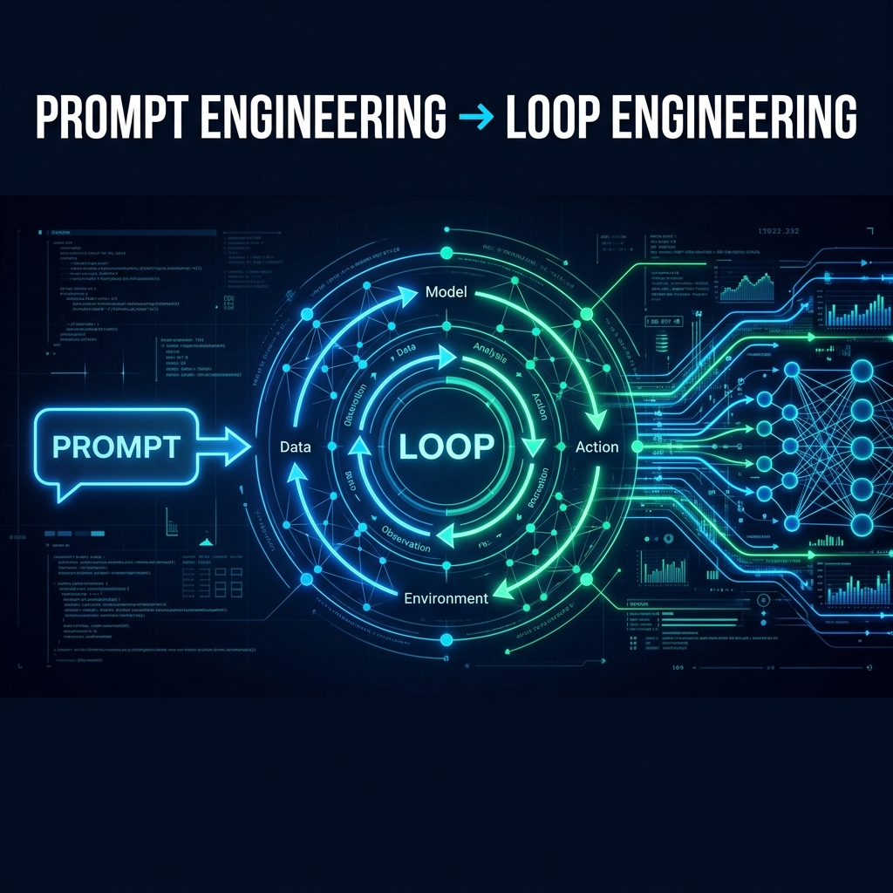

# ⚡ From Prompt Engineering to Loop Engineering


---

## The Story: How We Got Here

It all started with **a simple text box.**

In 2022, ChatGPT gave millions of people access to a language model for the first time. The reaction was predictable: *"How do I ask it better questions to get better answers?"* — and so **Prompt Engineering** was born.

### The Era of Prompt Engineering (2022–2024)

Prompt Engineering was the art of **phrasing your instructions correctly.** We learned to:
- Write detailed system prompts (`"Act as a senior engineer..."`)
- Provide examples before the question (few-shot)
- Ask the model to "think step by step" (chain-of-thought)

It worked — up to a point.

### The Problem

No matter how good your prompt is, **there is a ceiling you cannot break through:**

```
You  →  [Prompt]  →  Model  →  Answer  →  DONE
```

This architecture is **one-shot**: one input, one output, finished. You cannot make the model:
- ❌ Check whether its own answer is correct
- ❌ Pull live data from the internet or a database
- ❌ Retry when something fails
- ❌ Coordinate with other models for complex tasks

### The Solution: Loop Engineering (2025–2026)

Instead of one prompt → one answer, engineers started building **closed loops:**

```
You  →  [Task]  →  Agent  →  Think  →  Act  →  Observe
                     ↑                              |
                     └──────── Repeat until done ───┘
```

Now the model doesn't just answer — **it works.** It uses tools, evaluates its own output, corrects mistakes, and stops only when the result meets a quality threshold.

**This is the difference between a chatbot and an AI agent.**

---

## The Full Spectrum: 7 Levels

```
LEVEL 1          LEVEL 2          LEVEL 3
Zero-Shot   →    Few-Shot    →    Chain-of-Thought
"Just ask"       "Give examples"  "Think step by step"

     ▼ THE CEILING OF PROMPT ENGINEERING ▼

LEVEL 4          LEVEL 5          LEVEL 6             LEVEL 7
Tool Use    →    ReAct Loop  →    Self-Correction  →  Multi-Agent
"Access              "Think +         "Generate →        "Specialized
 external            Act +             Critique →          agents
 tools"              Observe,          Revise"             collaborate"
                     repeat"
```

---

## 📂 File Structure

### Part 1 — Prompt Engineering (Levels 1–3)
| Level | File | What You Learn |
|---|---|---|
| 1 | [`01_zero_shot.py`](01_prompt_engineering/01_zero_shot.py) | The baseline. One instruction, one answer. You quickly hit the limits. |
| 2 | [`02_few_shot.py`](01_prompt_engineering/02_few_shot.py) | Examples anchor the model's behavior. Output becomes consistent and predictable. |
| 3 | [`03_chain_of_thought.py`](01_prompt_engineering/03_chain_of_thought.py) | Force step-by-step reasoning. The ceiling of single-pass thinking. |

### Part 2 — Loop Engineering (Levels 4–7)
| Level | File | What You Learn |
|---|---|---|
| 4 | [`01_tool_use.py`](02_loop_engineering/01_tool_use.py) | The model decides on its own when and which tool to call. First contact with the real world. |
| 5 | [`02_react_loop.py`](02_loop_engineering/02_react_loop.py) | **Thought → Action → Observation → repeat.** The foundation of every AI agent. |
| 6 | [`03_self_correction.py`](02_loop_engineering/03_self_correction.py) | **Generate → Critique → Revise.** The model evaluates and improves its own work in a loop. |
| 7 | [`04_multi_agent.py`](02_loop_engineering/04_multi_agent.py) | Orchestrator + Researcher + Writer + Critic. Each agent has a role. The output exceeds what any single agent could produce. |

---

## Why Did This Shift Happen?

Three technological changes made it possible:

**1. Models became reliable enough to use tools.**
GPT-4's function calling (2023) gave models the ability to interact with external APIs in a structured, predictable way — something earlier models couldn't do reliably.

**2. Inference cost dropped dramatically.**
Running 10 inference calls for one task that previously required 1 became economically viable. That enabled loops.

**3. Frameworks like LangChain, LangGraph, and AutoGen removed the complexity.**
You no longer need to build the orchestrator from scratch. Frameworks handle state management, memory, and tool routing.

---

## Prompt Engineering vs Loop Engineering — Side by Side

| | Prompt Engineering | Loop Engineering |
|---|---|---|
| **Execution model** | Single forward pass | Iterative loop |
| **Tools** | None (text only) | APIs, databases, code execution |
| **Error handling** | You retry manually | Agent retries automatically |
| **Self-evaluation** | Not possible | Built-in critique step |
| **Memory** | Context window only | Persistent memory store |
| **Multi-step tasks** | Limited by context | Unlimited (loop continues) |
| **Coordination** | Single model | Multi-agent orchestration |
| **Output quality** | Depends on prompt | Improves through iterations |
| **Cost per task** | 1 API call | N API calls (N = loop iterations) |
| **Best for** | Simple Q&A, formatting | Complex tasks, autonomous work |

---

## 🗺️ Roadmap

Patterns we're building next — contributions welcome:

- [ ] **Level 8: Plan-and-Execute** — agent plans all steps before executing any
- [ ] **Level 9: Debate Loop** — two agents argue opposing positions, a judge agent decides
- [ ] **Level 10: Reflection Loop** — agent reviews its own failure history before retrying
- [ ] **Framework equivalents** — LangGraph, AutoGen, and CrewAI versions of each pattern
- [ ] **Benchmarks** — automated quality metrics for each level vs the previous

---

## 🎁 Bonus Patterns

Beyond the 7 core levels, the `03_patterns/` directory contains advanced patterns:

| Pattern | File | What It Adds |
|---|---|---|
| Memory Loop | [`memory_loop.py`](03_patterns/memory_loop.py) | Agent remembers across tasks — improves over time |

---

## 🚀 Run the Examples

```bash
git clone https://github.com/karidasd/prompt-to-loop-engineering.git
cd prompt-to-loop-engineering
pip install -r requirements.txt
export OPENAI_API_KEY=your_key_here

# Run in order — feel the progression
python 01_prompt_engineering/01_zero_shot.py
python 01_prompt_engineering/02_few_shot.py
python 01_prompt_engineering/03_chain_of_thought.py
python 02_loop_engineering/01_tool_use.py
python 02_loop_engineering/02_react_loop.py
python 02_loop_engineering/03_self_correction.py
python 02_loop_engineering/04_multi_agent.py
```

**Compatible with any OpenAI-compatible API** — OpenAI, Groq, Ollama, Azure OpenAI.

---

## 📖 Further Reading

- [ReAct: Synergizing Reasoning and Acting in LLMs](https://arxiv.org/abs/2210.03629)
- [Constitutional AI — Anthropic](https://arxiv.org/abs/2212.08073)
- [Toolformer: Language Models Can Teach Themselves to Use Tools](https://arxiv.org/abs/2302.04761)
- [LangGraph — Production loop orchestration](https://github.com/langchain-ai/langgraph)
- [AutoGen — Microsoft multi-agent framework](https://github.com/microsoft/autogen)

---

## 🤝 Contributing

See [CONTRIBUTING.md](CONTRIBUTING.md) for the full guide.

The rules are simple: be specific, run your code before submitting, and explain what your pattern **still can't do** — that's what motivates the next level.

---

> Built by **[DARKAIS Data Science](https://github.com/karidasd)** · 2026
> If this repo changed how you think about AI systems — give it a ⭐
